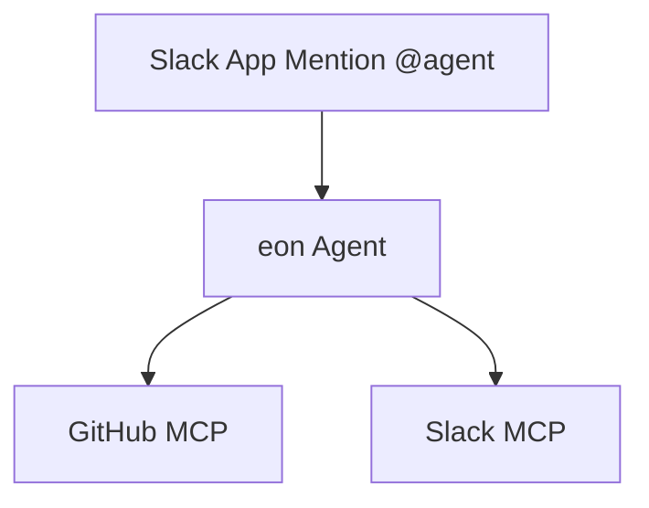

# Eon — Your Internal Slack Agent

Your business already has the answers — in Slack threads, GitHub pull requests, Linear tasks, your docs, and Salesforce service tickets. But those answers are scattered, hard to find, and often forgotten.

**Eon brings them back to the surface.**

Ask a question in Slack:
- "What did we ship last week?"
- "What's blocking the release?"
- "Summarize the latest GitHub pull requests."

Eon responds instantly, pulling from the tools you already use. No new UI, no new workflow — just answers in Slack, where your team already works.

---

## Why Eon?

- **Unlock hidden value**: Your Slack, GitHub, and Linear data already contain the insights you need. Eon makes them accessible.
- **Faster decisions**: Instead of searching or asking around, your team can get answers in seconds.
- **Easy to run**: The agent and MCP servers run statelessly in your own infrastructure, lightweight and simple to deploy.
- **Seamless with Tiger**: Eon uses a Tiger Postgres service (starting with a free plan). Prefer to self-host? Any Postgres instance with TimescaleDB works.
- **Grows with you**: Start with Slack and GitHub today. Add docs, Salesforce, and more tomorrow.

---

## What Eon Can Do

**Available now**
- **Slack** — Ask questions across your company's conversations and history
- **GitHub (optional)** — Summarize pull requests, issues, and activity
- **Linear (optional)** — Stay on top of project tasks and issues

**Coming soon**
- **Docs** — Search and summarize company knowledge
- **Salesforce** — Surface customer updates, opportunities, and account insights

---

# Demo

## Track Latest Project Developments

Stay up-to-date with what's happening across your projects and team members with intelligent progress tracking.


*Get comprehensive insights into recent developments, and cross-platform project updates.*

## Understand Technical Changes via the Github integration


*Analyze technical changes, review code modifications, and understand the evolution of your projects.*

# Setup

## Requirements

* [git](https://git-scm.com/)
* [Docker](https://www.docker.com/)
* Accounts on:
  * [Slack](https://slack.com/)
  * [GitHub](https://github.com/) (Optional)
  * [Anthropic](https://www.anthropic.com/)

## Interactive Setup (Recommended)

``` bash
git clone git@github.com:timescale/tiger-eon.git
cd tiger-eon
./setup-tiger-eon.sh
```

## Manual Setup

```bash
git clone git@github.com:timescale/tiger-eon.git
cd tiger-eon
cp .env.sample .env
```

### Setup Anthropic Token

1. Go to https://console.anthropic.com/settings/keys
2. Click "Create Key" and give it a workspace and name
3. Copy the value into `.env` where it says `ANTHROPIC_API_KEY`

### Setup GitHub token

1. Go to https://github.com/settings/tokens/new?description=Tiger%20Agent&scopes=repo,read:org
2. Change the token name, set expiration date, and then hit "Generate token"
3. Copy the value into `.env` where it says `GITHUB_TOKEN`
4. Set the `GITHUB_ORG` value in `.env` to your GitHub organization (e.g. if https://github.com/timescale was your org page, then set `GITHUB_ORG=timescale`).

### Setup Slack Ingest/MCP

1. Go to https://api.slack.com/apps/
2. Hit "Create New App" and select "From a manifest"
3. Select your org's workspace to install the org into
4. Copy https://raw.githubusercontent.com/timescale/tiger-slack/refs/heads/main/slack-app-manifest.json into the JSON input, changing the `display_information.name` and `features.bot_user.name` fields as needed
5. Click "Next" and then "Create" buttons
6. Scroll down on the page to "App-Level Tokens" and click "Generate Token and Scopes"
7. Give it a name and set the `connections:write` scope.
8. Copy the token into `.env` where it says `SLACK_INGEST_APP_TOKEN`
9. Click "Install App" on the left sidebar, and the click "Install to ..." button on this page
10. Grant the necessary permission and advance to the next page
11. Copy the "Bot User OAuth Token" (starts with `xoxb-`) into `.env` file where it says `SLACK_INGEST_BOT_TOKEN`

### Setup Slack Agent

Follow the steps for seting up Slack Ingest/MCP, except:

* For step (4), use https://raw.githubusercontent.com/timescale/tiger-agents-for-work/refs/heads/main/slack-manifest.json instead, changing the same fields as needed for the name.
* For step (8), set the token to `SLACK_AGENT_APP_TOKEN`
* For step (11), set the token to `SLACK_AGENT_BOT_TOKEN`

### Setup Logfire (Optional)

1. Log into https://logfire.pydantic.dev/login (set region as necessary)
2. Under "Projects", click "New project"
3. Give it a name and hit "Create"
4. On next page, click "Generate Write Token"
5. Copy that into the `.env` file under `LOGFIRE_TOKEN`

## Start Services

To start only configured services (based on `mcp_config.json`):

```bash
./start.sh
```

To start all services:

```bash
docker compose up -d --build
```

## Customize

You can customize the MCP servers by [editing a configuration file](/docs/mcp-config.md). To modify the system or user prompts, [edit the Jinja2 templates](/docs/prompts.md).

## Import Slack Data

To make the Slack MCP server more powerful, you can also restore a dump of your slack data, allowing eon to answer questions about historical
threads or channels, and not just from when it was setup. To do so:

1. Follow the [Slack Docs](https://slack.com/help/articles/201658943-Export-your-workspace-data) on getting an export of your workspace
2. Download the zip to your computer, and unzip it
3. Run `./import-slack.sh <path/to/slack/export>` replacing the argument with the actual path to your dump.

# High-Level Architecture

Eon leverages the [tiger-agents-for-work](https://github.com/timescale/tiger-agents-for-work) library, which provides Slack event handling with robust event queuing/retrying and TimescaleDB-powered event history.



* Agent + MCP servers — run statelessly in your infrastructure, easy to deploy and scale.
* Postgres — state. Use Tiger (with free plans) for seamless setup, or self-host Postgres if you prefer.
* MCP servers — connect to Slack history, GitHub.

# Contributing

Eon is open source under the Apache 2.0 license.
Contributions welcome — file issues or PRs in GitHub Issues.
