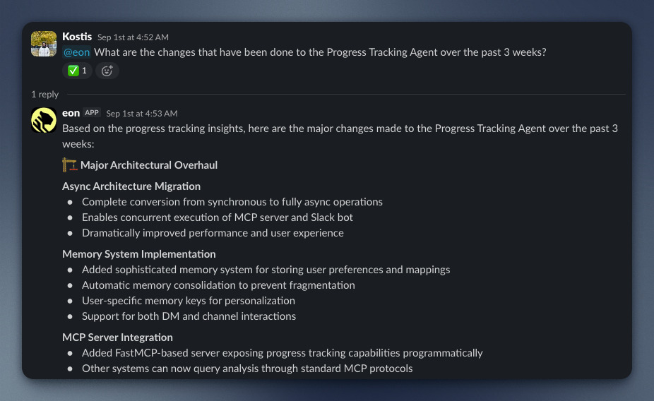

# tiger-eon

## What Can EON Do?

### 📊 Track Latest Project Developments
Stay up-to-date with what's happening across your projects and team members with intelligent progress tracking.



*Get comprehensive insights into recent developments, and cross-platform project updates.*

### 🔍 Understand Technical Changes via the Github integration


*Analyze technical changes, review code modifications, and understand the evolution of your projects.*

## Requirements

* [git](https://git-scm.com/)
* [Docker](https://www.docker.com/)
* Accounts on:
  * [Slack](https://slack.com/)
  * [GitHub](https://github.com/) (Optional)
  * [Anthropic](https://www.anthropic.com/)

## Setup

## Interactive Setup (Recommended)

``` bash
git clone git@github.com:timescale/tiger-eon.git
cd tiger-eon
./setup-tiger-eon.sh
```

## Manual Setup

```bash
git clone git@github.com:timescale/tiger-eon.git
cd tiger-eon
cp .env.sample .env
```

### Setup Anthropic Token

1. Go to https://console.anthropic.com/settings/keys
2. Click "Create Key" and give it a workspace and name
3. Copy the value into `.env` where it says `ANTHROPIC_API_KEY`

### Setup GitHub token

1. Go to https://github.com/settings/tokens/new?description=Tiger%20Agent&scopes=repo,read:org
2. Change the token name, set expiration date, and then hit "Generate token"
3. Copy the value into `.env` where it says `GITHUB_TOKEN`
4. Set the `GITHUB_ORG` value in `.env` to your GitHub organization (e.g. if https://github.com/timescale was your org page, then set `GITHUB_ORG=timescale`).

### Setup Slack Ingest/MCP

1. Go to https://api.slack.com/apps/
2. Hit "Create New App" and select "From a manifest"
3. Select your org's workspace to install the org into
4. Copy https://raw.githubusercontent.com/timescale/tiger-slack/refs/heads/main/slack-app-manifest.json into the JSON input, changing the `display_information.name` and `features.bot_user.name` fields as needed
5. Click "Next" and then "Create" buttons
6. Scroll down on the page to "App-Level Tokens" and click "Generate Token and Scopes"
7. Give it a name and set the `connections:write` scope.
8. Copy the token into `.env` where it says `SLACK_INGEST_APP_TOKEN`
9. Click "Install App" on the left sidebar, and the click "Install to ..." button on this page
10. Grant the necessary permission and advance to the next page
11. Copy the "Bot User OAuth Token" (starts with `xoxb-`) into `.env` file where it says `SLACK_INGEST_BOT_TOKEN`

### Setup Slack Agent

Follow the steps for seting up Slack Ingest/MCP, except:

* For step (4), use https://raw.githubusercontent.com/timescale/tiger-agents-for-work/refs/heads/main/slack-manifest.json instead, changing the same fields as needed for the name.
* For step (8), set the token to `SLACK_AGENT_APP_TOKEN`
* For step (11), set the token to `SLACK_AGENT_BOT_TOKEN`

### Setup Logfire (Optional)

1. Log into https://logfire.pydantic.dev/login (set region as necessary)
2. Under "Projects", click "New project"
3. Give it a name and hit "Create"
4. On next page, click "Generate Write Token"
5. Copy that into the `.env` file under `LOGFIRE_TOKEN`

## Start Services

To start only configured services (based on `mcp_config.json`):

```bash
./start.sh
```

To start all services:

```bash
docker compose up -d --build
```

## Customize

You can customize the MCP servers by [editing a configuration file](/docs/mcp-config.md). To modify the system or user prompts, [edit the Jinja2 templates](/docs/prompts.md).
